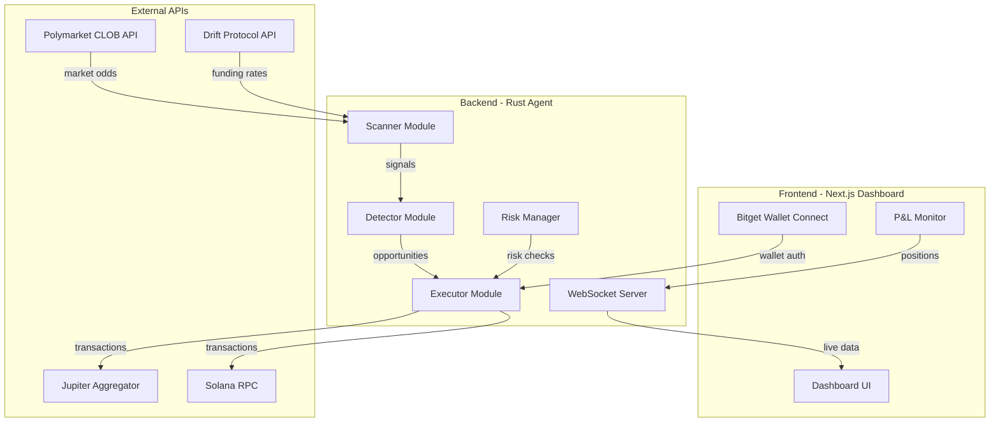
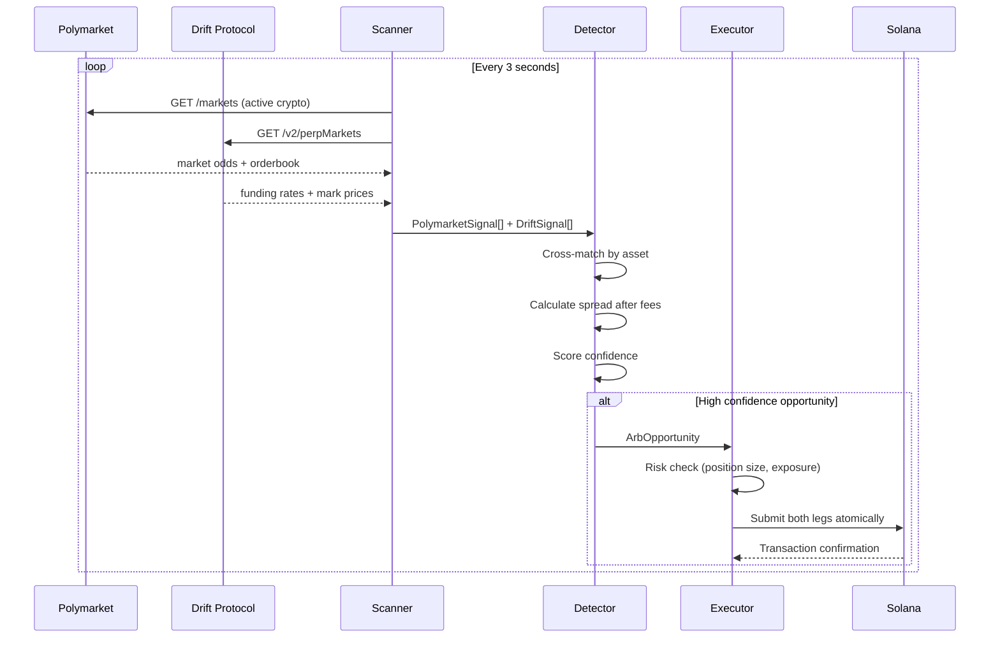
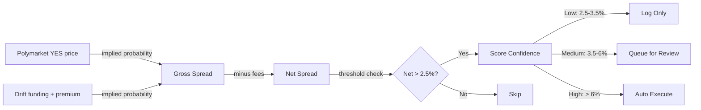

# SolArb Agent

**The Arbitrage Skill Layer for Solana Agents**

Autonomous agent that detects and executes arbitrage between Polymarket prediction market odds and Drift Protocol perpetual funding rates on Solana. Built for the Solana Agent Economy Hackathon: Agent Talent Show.

---

## Table of Contents

- [Overview](#overview)
- [Problem](#problem)
- [Solution](#solution)
- [Architecture](#architecture)
- [Modules](#modules)
- [How It Works](#how-it-works)
- [Tech Stack](#tech-stack)
- [Project Structure](#project-structure)
- [Getting Started](#getting-started)
- [Configuration](#configuration)
- [Roadmap](#roadmap)
- [Hackathon Context](#hackathon-context)
- [Submission](#submission)
- [License](#license)

---

## Overview

SolArb Agent is an autonomous on-chain agent with one clear skill: **detect probability mispricing between prediction markets and perpetual futures, then execute arbitrage trades to capture the spread**.

In the agent economy, this agent has a job. It scans, it calculates, it trades. Humans set the budget and risk parameters. The agent does the rest.

| Attribute | Detail |
|---|---|
| Agent Skill | Cross-venue arbitrage detection and execution |
| Signal Source | Polymarket CLOB (prediction market odds) |
| Hedge Venue | Drift Protocol (perpetual futures on Solana) |
| Execution | Jupiter Aggregator for optimal routing on Solana |
| Wallet | Bitget Wallet SDK for fund management |
| Decision Speed | Sub-second signal processing, 3-second scan cycles |
| Risk Controls | Max position size, daily loss stop, exposure limits |

---

## Problem

Arbitrage opportunities exist between prediction markets and derivatives markets. When Polymarket prices BTC going up at 40% but Drift perpetual funding implies 65%, there is a 25% gross spread to capture.

Humans cannot exploit this because:

1. **Speed** -- opportunities close in seconds, humans react in minutes
2. **Complexity** -- requires simultaneous execution on two venues across two chains
3. **Emotion** -- humans hesitate, second-guess, and miss windows
4. **Availability** -- markets run 24/7, humans do not

---

## Solution

SolArb Agent solves this with a fully autonomous pipeline:

1. **Scan** -- pull live odds from Polymarket and funding rates from Drift every 3 seconds
2. **Detect** -- cross-match signals, calculate net spread after all fees
3. **Score** -- assign confidence level (Low / Medium / High) based on spread magnitude
4. **Execute** -- place both legs atomically: buy prediction token + open perp position
5. **Monitor** -- track P&L, manage risk, close positions at resolution

---

## Architecture



### Data Flow



### Spread Calculation Model



---

## Modules

| Module | Location | Status | Description |
|---|---|---|---|
| Types | `backend/src/types.rs` | Done | Core data structures: Asset, Signal types, ArbOpportunity, AgentConfig |
| Polymarket Scanner | `backend/src/scanner/polymarket.rs` | Done | Fetches active crypto markets, parses orderbooks, estimates taker fees |
| Drift Scanner | `backend/src/scanner/drift.rs` | Done | Fetches perp markets, parses funding rates, computes implied probability |
| Arb Detector | `backend/src/detector/mod.rs` | Done | Cross-matches signals, calculates spreads, scores confidence |
| Main Loop | `backend/src/main.rs` | Done | Async scan loop, state tracking, logging |
| Executor | `backend/src/executor/` | Planned | On-chain trade execution via Jupiter + Drift SDK |
| Risk Manager | `backend/src/risk/` | Planned | Position limits, daily loss stops, exposure tracking |
| Wallet | `backend/src/wallet/` | Planned | Solana keypair management, Bitget Wallet SDK integration |
| WebSocket Server | `backend/src/ws/` | Planned | Real-time data feed to frontend dashboard |
| Frontend | `frontend/` | Planned | Next.js dashboard with Bitget Wallet connect |

---

## How It Works

### Step 1: Signal Collection

The scanner pulls data from two venues simultaneously:

| Venue | Data Pulled | What It Tells Us |
|---|---|---|
| Polymarket | YES token bid/ask/mid price per market | Market's implied probability of an event (e.g., "BTC up in 15 min") |
| Drift Protocol | Funding rate (1h), mark price, oracle price | Derivatives market's directional sentiment via premium and funding |

### Step 2: Probability Comparison

Polymarket gives probability directly (YES price = implied probability).

Drift probability is derived from a heuristic model:
- Mark premium > 0 means futures trade at premium, meaning bullish sentiment
- Positive funding rate means longs pay shorts, meaning market is skewed long
- Both signals are blended and normalized to a 0-1 probability scale

### Step 3: Spread and Fee Calculation

| Fee Component | Model |
|---|---|
| Polymarket taker fee | Dynamic: `fee = 0.126 * p * (1 - p)`, peaks at 3.15% when p = 0.50 |
| Drift taker fee | Fixed tier: 0.1% (10 bps) for fresh accounts |
| Net spread | `abs(poly_prob - drift_prob) - poly_fee - drift_fee` |

### Step 4: Confidence Scoring

| Confidence | Net Spread Range | Action |
|---|---|---|
| Low | 2.5% - 3.5% | Log only |
| Medium | 3.5% - 6.0% | Queue for review |
| High | > 6.0% | Auto-execute (when executor is live) |

### Step 5: Trade Execution (Sprint 2)

When a High confidence opportunity is detected:

| If Polymarket underprices UP | If Drift underprices UP |
|---|---|
| BUY YES token on Polymarket | BUY NO token on Polymarket |
| SHORT perp on Drift | LONG perp on Drift |
| Profit if event resolves YES | Profit if event resolves NO |

---

## Tech Stack

| Layer | Technology | Purpose |
|---|---|---|
| Agent Runtime | Rust + Tokio | Async, fast, memory-safe agent core |
| HTTP Client | reqwest | API calls to Polymarket and Drift |
| Decimal Math | rust_decimal | No floating-point rounding errors on financial calculations |
| Blockchain | Solana (mainnet-beta) | On-chain execution target |
| DEX Routing | Jupiter Aggregator | Optimal swap routing on Solana |
| Perpetuals | Drift Protocol | Largest perp DEX on Solana |
| Prediction Market | Polymarket (via CLOB API) | Signal source for arbitrage |
| Wallet | Bitget Wallet SDK | Agent wallet management (required for Bitget prize pool) |
| Frontend | Next.js + Tailwind CSS | Dashboard UI |
| Deployment | Vercel | Frontend hosting |

---

## Project Structure

```
solarb-agent/
├── .gitignore
├── CLAUDE.md                   # Project guidelines
├── README.md
├── backend/                    # Rust agent (cargo)
│   ├── Cargo.toml
│   ├── Cargo.lock
│   ├── .env.example
│   └── src/
│       ├── main.rs             # Entry point + scan loop + execution
│       ├── types.rs            # Core data structures
│       ├── scanner/
│       │   ├── mod.rs
│       │   ├── polymarket.rs   # Polymarket CLOB scanner
│       │   └── drift.rs        # Drift Protocol scanner
│       ├── detector/
│       │   └── mod.rs          # Arbitrage detection + scoring
│       ├── executor/
│       │   ├── mod.rs          # Trade orchestrator + exit logic
│       │   ├── drift_executor.rs # Drift perp order placement
│       │   └── jupiter.rs      # Jupiter swap quotes + execution
│       ├── risk/
│       │   └── mod.rs          # Position tracking + risk gates
│       ├── wallet/
│       │   └── mod.rs          # Solana keypair + balance queries
│       └── ws/                 # (planned) WebSocket server for frontend
├── frontend/                   # Next.js 15 dashboard (pnpm)
│   ├── package.json
│   ├── next.config.ts
│   ├── tailwind.config.ts
│   ├── tsconfig.json
│   ├── public/
│   │   └── bg/                 # Anime-style background assets
│   └── src/
│       ├── app/
│       │   ├── layout.tsx      # Root layout + fonts
│       │   ├── page.tsx        # Landing page (hero + agent info)
│       │   ├── dashboard/
│       │   │   └── page.tsx    # Live dashboard (positions, P&L, feed)
│       │   └── globals.css     # Tailwind + custom animations
│       ├── components/
│       │   ├── AnimatedBg.tsx      # CSS animated anime landscape
│       │   ├── Hero.tsx            # Landing hero section
│       │   ├── AgentStats.tsx      # Agent status cards
│       │   ├── LiveFeed.tsx        # Real-time opportunity feed
│       │   ├── PositionCard.tsx    # Open position display
│       │   ├── PnlChart.tsx        # P&L visualization
│       │   └── WalletConnect.tsx   # Bitget Wallet connect button
│       ├── hooks/
│       │   └── useWebSocket.ts     # WebSocket hook for agent data
│       └── lib/
│           └── types.ts            # Shared TypeScript types
└── sc/                         # (planned) Smart contracts, if needed
```

---

## Getting Started

### Prerequisites

- Rust 1.75+ (install via https://rustup.rs)
- Node.js 18+ and pnpm (install via `npm i -g pnpm`)

### Run the Agent (Backend)

```bash
cd backend
cp .env.example .env
# Edit .env with your RPC endpoint and parameters
cargo run
```

### Run the Dashboard (Frontend)

```bash
cd frontend
pnpm install
pnpm dev
```

### Run Tests

```bash
cd backend && cargo test
```

### Environment Variables

Backend: see `backend/.env.example`
Frontend: see `frontend/.env.example`

---

## Configuration

### Backend (`backend/.env`)

| Variable | Default | Description |
|---|---|---|
| `POLYMARKET_API` | `https://clob.polymarket.com` | Polymarket CLOB API endpoint |
| `DRIFT_API` | `https://mainnet-beta.api.drift.trade` | Drift Protocol REST API endpoint |
| `SOLANA_RPC` | `https://api.devnet.solana.com` | Solana RPC endpoint |
| `SOLANA_NETWORK` | `devnet` | Network: `devnet` or `mainnet` |
| `JUPITER_API` | `https://quote-api.jup.ag/v6` | Jupiter V6 API endpoint |
| `MIN_NET_SPREAD` | `0.025` | Minimum net spread (0.025 = 2.5%) |
| `MAX_POSITION_USDC` | `500` | Max USDC per trade |
| `MAX_TOTAL_EXPOSURE_USDC` | `2000` | Max total exposure |
| `SCAN_INTERVAL_SECS` | `3` | Seconds between scans |
| `DRY_RUN` | `true` | Log trades without sending transactions |
| `TAKE_PROFIT_PCT` | `0.50` | Take profit at 50% of entry spread |
| `STOP_LOSS_PCT` | `1.00` | Stop loss at 100% of entry spread |
| `DAILY_LOSS_STOP_USDC` | `200` | Max daily loss before halting |
| `MAX_OPEN_POSITIONS` | `5` | Max concurrent positions |
| `AGENT_KEYPAIR_PATH` | _(none)_ | Path to Solana keypair JSON file |
| `RUST_LOG` | `info` | Log level: info, debug, trace |

### Frontend (`frontend/.env.local`)

| Variable | Default | Description |
|---|---|---|
| `NEXT_PUBLIC_WS_URL` | `ws://localhost:9944` | WebSocket URL for agent data |
| `NEXT_PUBLIC_AGENT_API_URL` | `http://localhost:8080` | Agent REST API URL |

---

## Roadmap

| Phase | Target | Deliverables | Status |
|---|---|---|---|
| Sprint 1 | Mar 11-15 | Scanner + Detector core logic, 14 unit tests | Done |
| Sprint 2 | Mar 16 | Executor + Risk + Wallet modules, 24 total tests | Done |
| Sprint 3 | Mar 16-21 | Frontend dashboard, Bitget Wallet connect, live P&L display | In Progress |
| Sprint 4 | Mar 22-27 | Demo video, X Article, submission polish | Planned |

### Sprint 2 Summary (Done)

| Module | Tests | Description |
|---|---|---|
| Wallet | 1 | Keypair loading, SOL/USDC balance queries, tx signing |
| Risk Manager | 6 | Position limits, exposure tracking, daily loss stop |
| Trade Executor | 2 | Drift perp execution, TP/SL exit conditions, dry-run mode |
| Drift Executor | - | REST API order placement (open/close perp positions) |
| Jupiter Client | - | V6 quote + swap execution |

### Sprint 3 Breakdown (Frontend)

| Task | Description |
|---|---|
| Next.js 15 setup | App Router + TypeScript + Tailwind, using pnpm |
| Animated background | CSS-animated anime-style landscape, calming aesthetic |
| Landing page | Hero with agent intro, clean rounded cards, minimal text |
| Dashboard | Live opportunities feed, open positions, P&L chart |
| WebSocket hook | Real-time data from backend agent via WebSocket |
| Bitget Wallet | Wallet connect button (required for Bitget prize pool) |
| Deploy | Host on Vercel for public demo |

### Frontend Design Principles

| Principle | Detail |
|---|---|
| Layout | Modern rounded cards (glassmorphism), clean whitespace |
| Background | Animated anime-style landscape (calming, scenic) |
| Typography | Minimal text, large headings, small supporting copy |
| Colors | Soft gradients, muted palette with accent highlights |
| Icons/Emoji | None -- clean shapes and typography only |
| Motion | Subtle CSS animations, smooth transitions |
| Package manager | pnpm (not npm or yarn) |

---

## Hackathon Context

### Event

**Solana Agent Economy Hackathon: Agent Talent Show**

| Detail | Value |
|---|---|
| Prize Pool | $30,000 USDC |
| Co-hosts | Solana, Trends.fun |
| Sponsors | Bitget Wallet, Solana |
| Start | March 11, 2026, 14:00 UTC |
| Deadline | March 27, 2026, 14:00 UTC |
| Theme | "Build the skill that represents your agent. Show the app that empowers their agents." |

### How SolArb Fits the Theme

| Hackathon Ask | SolArb Answer |
|---|---|
| "Build the skill" | Cross-venue arbitrage detection and execution -- a concrete, measurable skill |
| "Show the app" | Dashboard where users deploy the agent, set risk parameters, and watch it earn |
| Agent Economy | The agent has a job (arbitrage), earns revenue (spread capture), and operates autonomously |

### Submission Process

1. Publish an X Article introducing SolArb Agent with links to GitHub repo, live app, and demo video
2. Quote RT the hackathon announcement post, tagging @trendsdotfun @solana_devs @BitgetWallet with hashtag #AgentTalentShow, including the X Article link

---

## License

MIT
