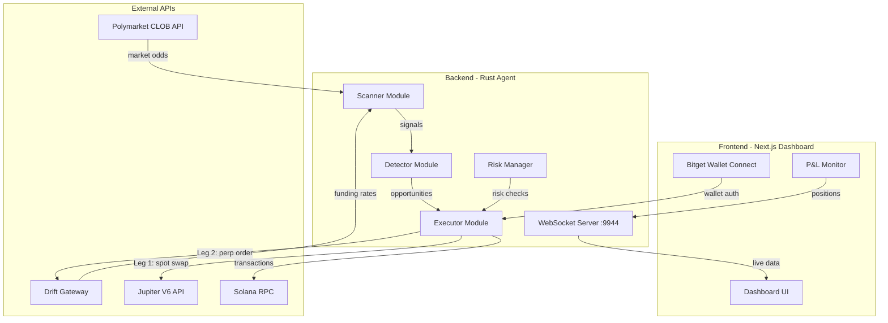
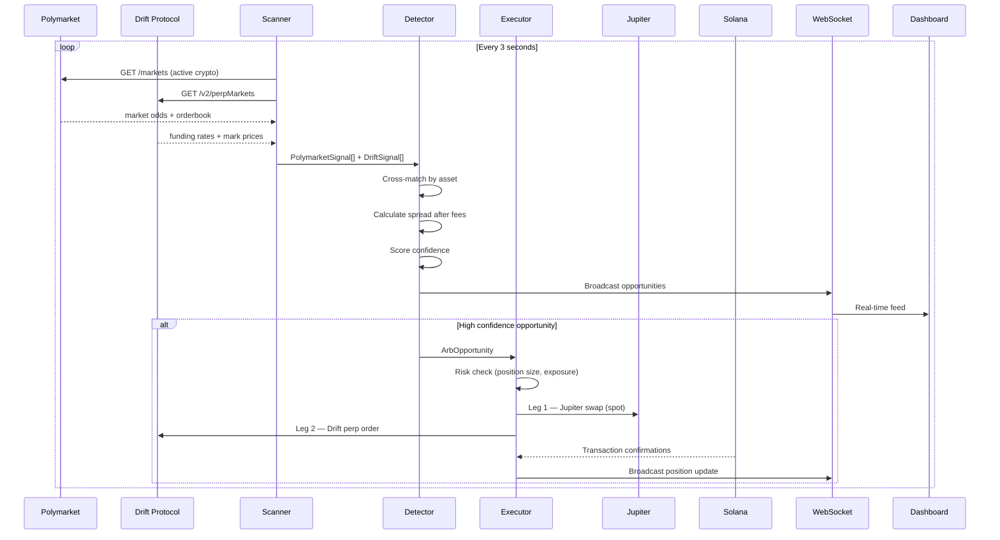
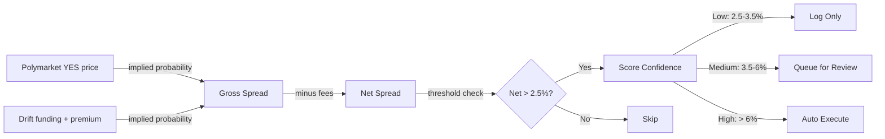

# SolArb Agent

**The Arbitrage Skill Layer for Solana Agents**

Autonomous agent that detects and executes arbitrage between Polymarket prediction market odds and Drift Protocol perpetual funding rates on Solana. Built for the Solana Agent Economy Hackathon: Agent Talent Show.

---

## Table of Contents

- [Overview](#overview)
- [Problem](#problem)
- [Solution](#solution)
- [Architecture](#architecture)
- [Modules](#modules)
- [How It Works](#how-it-works)
- [Tech Stack](#tech-stack)
- [Project Structure](#project-structure)
- [Getting Started](#getting-started)
- [Configuration](#configuration)
- [Roadmap](#roadmap)
- [Hackathon Context](#hackathon-context)
- [License](#license)

---

## Overview

SolArb Agent is an autonomous on-chain agent with one clear skill: **detect probability mispricing between prediction markets and perpetual futures, then execute arbitrage trades to capture the spread**.

In the agent economy, this agent has a job. It scans, it calculates, it trades. Humans set the budget and risk parameters. The agent does the rest.

| Attribute | Detail |
|---|---|
| Agent Skill | Cross-venue arbitrage detection and execution |
| Signal Source | Polymarket CLOB (prediction market odds) |
| Hedge Venue | Drift Protocol (perpetual futures on Solana) |
| Execution | Jupiter Aggregator for optimal swap routing on Solana |
| Wallet | Bitget Wallet SDK for fund management |
| Decision Speed | Sub-second signal processing, 3-second scan cycles |
| Risk Controls | Max position size, daily loss stop, exposure limits |

---

## Problem

Arbitrage opportunities exist between prediction markets and derivatives markets. When Polymarket prices BTC going up at 40% but Drift perpetual funding implies 65%, there is a 25% gross spread to capture.

Humans cannot exploit this because:

1. **Speed** -- opportunities close in seconds, humans react in minutes
2. **Complexity** -- requires simultaneous execution on two venues across two chains
3. **Emotion** -- humans hesitate, second-guess, and miss windows
4. **Availability** -- markets run 24/7, humans do not

---

## Solution

SolArb Agent solves this with a fully autonomous pipeline:

1. **Scan** -- pull live odds from Polymarket and funding rates from Drift every 3 seconds
2. **Detect** -- cross-match signals, calculate net spread after all fees
3. **Score** -- assign confidence level (Low / Medium / High) based on spread magnitude
4. **Execute** -- place both legs: Jupiter swap (spot exposure) + Drift perp position (hedge)
5. **Monitor** -- track P&L via WebSocket dashboard, manage risk, close positions on TP/SL

---

## Architecture



### Data Flow



### Spread Calculation Model



---

## Modules

| Module | Location | Status | Tests | Description |
|---|---|---|---|---|
| Types | `backend/src/types.rs` | Done | - | Core data structures: Asset, Signal types, ArbOpportunity, Position, AgentConfig |
| Polymarket Scanner | `backend/src/scanner/polymarket.rs` | Done | 4 | Fetches active crypto markets, parses orderbooks, dynamic taker fee model |
| Drift Scanner | `backend/src/scanner/drift.rs` | Done | 4 | Fetches perp markets, funding rates, implied probability heuristic |
| Arb Detector | `backend/src/detector/mod.rs` | Done | 6 | Cross-matches signals, calculates spreads, confidence scoring |
| Trade Executor | `backend/src/executor/mod.rs` | Done | 3 | Two-leg execution: Jupiter swap + Drift perp, TP/SL exit logic |
| Drift Executor | `backend/src/executor/drift_executor.rs` | Done | - | Drift Gateway REST API: open/close perp positions, mark price, retry logic |
| Jupiter Client | `backend/src/executor/jupiter.rs` | Done | - | V6 quote + swap execution, price impact guard, legacy tx signing |
| Risk Manager | `backend/src/risk/mod.rs` | Done | 6 | Position limits, exposure tracking, daily loss stop, sizing |
| Wallet | `backend/src/wallet/mod.rs` | Done | 1 | Solana keypair loading, SOL/USDC balance queries, tx signing |
| WebSocket Server | `backend/src/ws/mod.rs` | Done | - | Real-time broadcast to frontend: opportunities, positions, P&L, agent status |
| Main Loop | `backend/src/main.rs` | Done | - | Async scan loop, state tracking, WS integration, gateway health check |
| Frontend Landing | `frontend/app/page.tsx` | Done | - | Hero with agent mascot, how-it-works, venue cards, tech stack |
| Frontend Dashboard | `frontend/app/dashboard/page.tsx` | Done | - | Live feed, positions, P&L chart, agent stats, wallet connect |
| Animated Background | `frontend/components/AnimatedBg.tsx` | Done | - | Anime artwork backgrounds + CSS animated overlays (stars, clouds) |
| WebSocket Hook | `frontend/hooks/useWebSocket.ts` | Done | - | Auto-reconnecting WebSocket with typed messages |
| Bitget Wallet | `frontend/components/WalletConnect.tsx` | Done | - | Bitget Wallet SDK connect/disconnect |

**Total: 25 unit tests passing**

---

## How It Works

### Step 1: Signal Collection

The scanner pulls data from two venues simultaneously:

| Venue | Data Pulled | What It Tells Us |
|---|---|---|
| Polymarket | YES token bid/ask/mid price per market | Market's implied probability of an event (e.g., "BTC up in 15 min") |
| Drift Protocol | Funding rate (1h), mark price, oracle price | Derivatives market's directional sentiment via premium and funding |

### Step 2: Probability Comparison

Polymarket gives probability directly (YES price = implied probability).

Drift probability is derived from a heuristic model:
- Mark premium > 0 means futures trade at premium, meaning bullish sentiment
- Positive funding rate means longs pay shorts, meaning market is skewed long
- Both signals are blended and normalized to a 0-1 probability scale

### Step 3: Spread and Fee Calculation

| Fee Component | Model |
|---|---|
| Polymarket taker fee | Dynamic: `fee = 0.126 * p * (1 - p)`, peaks at 3.15% when p = 0.50 |
| Drift taker fee | Fixed tier: 0.1% (10 bps) for fresh accounts |
| Net spread | `abs(poly_prob - drift_prob) - poly_fee - drift_fee` |

### Step 4: Confidence Scoring

| Confidence | Net Spread Range | Action |
|---|---|---|
| Low | 2.5% - 3.5% | Log only |
| Medium | 3.5% - 6.0% | Queue for review |
| High | > 6.0% | Auto-execute |

### Step 5: Two-Leg Trade Execution

When a High confidence opportunity is detected, the executor runs two legs:

| If Polymarket underprices UP (`buy_poly_yes=true`) | If Drift underprices UP (`buy_poly_yes=false`) |
|---|---|
| **Leg 1 (Jupiter):** Swap USDC to target asset (spot buy) | **Leg 1 (Jupiter):** Swap target asset to USDC (spot sell) |
| **Leg 2 (Drift):** Open SHORT perp position (hedge) | **Leg 2 (Drift):** Open LONG perp position (hedge) |
| Profit if event resolves YES | Profit if event resolves NO |

Jupiter provides optimal swap routing across all Solana DEXs. Drift Gateway handles on-chain perp order placement with transaction signing.

### Step 6: Position Monitoring

Every scan cycle, the agent checks open positions against TP/SL thresholds:

| Condition | Action |
|---|---|
| Price hits Take Profit | Close Drift perp + unwind Jupiter swap |
| Price hits Stop Loss | Close Drift perp + unwind Jupiter swap |
| Daily loss exceeds limit | Halt all new trades |

All position updates and P&L changes are broadcast via WebSocket to the frontend dashboard in real-time.

---

## Tech Stack

| Layer | Technology | Purpose |
|---|---|---|
| Agent Runtime | Rust + Tokio | Async, fast, memory-safe agent core |
| HTTP Client | reqwest | API calls to Polymarket, Drift, Jupiter |
| WebSocket | tokio-tungstenite | Real-time data broadcast to frontend |
| Decimal Math | rust_decimal | No floating-point rounding errors on financial calculations |
| Blockchain | Solana (devnet / mainnet) | On-chain execution target |
| DEX Routing | Jupiter V6 API | Optimal swap routing across all Solana DEXs |
| Perpetuals | Drift Protocol (via Gateway) | Largest perp DEX on Solana |
| Prediction Market | Polymarket (via CLOB API) | Signal source for arbitrage |
| Wallet | Bitget Wallet SDK | Frontend wallet connection (Bitget prize pool) |
| Frontend | Next.js 16 + Tailwind CSS v4 | Dashboard UI with glassmorphism design |
| Background Art | AI-generated anime artwork (WebP) | Unique visual identity |
| Deployment | Vercel | Frontend hosting |

---

## Project Structure

```
solarb-agent/
├── .gitignore
├── CLAUDE.md                      # Project guidelines
├── README.md                      # This file
├── backend/                       # Rust agent (cargo)
│   ├── Cargo.toml
│   ├── Cargo.lock
│   ├── .env.example
│   └── src/
│       ├── main.rs                # Entry point + scan loop + WS integration
│       ├── types.rs               # Core data structures
│       ├── scanner/
│       │   ├── mod.rs
│       │   ├── polymarket.rs      # Polymarket CLOB scanner
│       │   └── drift.rs           # Drift Protocol scanner
│       ├── detector/
│       │   └── mod.rs             # Arbitrage detection + scoring
│       ├── executor/
│       │   ├── mod.rs             # Two-leg trade orchestrator
│       │   ├── drift_executor.rs  # Drift Gateway perp execution
│       │   └── jupiter.rs         # Jupiter V6 swap execution
│       ├── risk/
│       │   └── mod.rs             # Position tracking + risk gates
│       ├── wallet/
│       │   └── mod.rs             # Solana keypair + balance queries
│       └── ws/
│           └── mod.rs             # WebSocket server for frontend
├── frontend/                      # Next.js 16 dashboard (pnpm)
│   ├── package.json
│   ├── next.config.ts
│   ├── postcss.config.mjs
│   ├── tsconfig.json
│   ├── .env
│   ├── public/
│   │   └── bg/                    # AI-generated anime artwork (WebP)
│   │       ├── main-background.webp
│   │       ├── dashboard-background.webp
│   │       ├── agent-character.webp
│   │       ├── section-divider.webp
│   │       ├── landing-page-bottom.webp
│   │       └── card-background-texture.webp
│   ├── app/
│   │   ├── layout.tsx             # Root layout + Geist fonts
│   │   ├── page.tsx               # Landing page (hero + info sections)
│   │   ├── dashboard/
│   │   │   └── page.tsx           # Live trading dashboard
│   │   └── globals.css            # Design system + animations
│   ├── components/
│   │   ├── AnimatedBg.tsx         # Anime background + CSS overlays
│   │   ├── Hero.tsx               # Landing hero with agent mascot
│   │   ├── AgentStats.tsx         # Agent status cards
│   │   ├── LiveFeed.tsx           # Real-time opportunity feed
│   │   ├── PositionCard.tsx       # Open position display
│   │   ├── PnlChart.tsx           # SVG P&L chart
│   │   └── WalletConnect.tsx      # Bitget Wallet connect button
│   ├── hooks/
│   │   └── useWebSocket.ts        # Auto-reconnecting WebSocket hook
│   └── lib/
│       └── types.ts               # Shared TypeScript types
└── img/                           # Original PNG artwork (source files)
```

---

## Getting Started

### Prerequisites

| Tool | Version | Install |
|---|---|---|
| Rust | 1.75+ | `curl --proto '=https' --tlsv1.2 -sSf https://sh.rustup.rs \| sh` |
| Node.js | 18+ | https://nodejs.org |
| pnpm | 9+ | `npm i -g pnpm` |
| Solana CLI | 2.0+ | `sh -c "$(curl -sSfL https://release.anza.xyz/stable/install)"` |

### Step 1: Clone and Setup

```bash
git clone https://github.com/your-repo/solarb-agent.git
cd solarb-agent
```

### Step 2: Configure Backend

```bash
cd backend
cp .env.example .env
```

Edit `.env` with your settings. For scan-only mode (no trading), the defaults work out of the box.

### Step 3: Create a Solana Wallet (optional, for live trading)

```bash
# Generate a dedicated agent keypair (NEVER use your main wallet)
solana-keygen new --outfile ~/.config/solana/solarb-agent.json

# Fund it on devnet
solana airdrop 2 --keypair ~/.config/solana/solarb-agent.json --url devnet

# Set the path in .env
# AGENT_KEYPAIR_PATH=~/.config/solana/solarb-agent.json
```

### Step 4: Run the Backend Agent

```bash
cd backend

# Scan-only mode (default, safe)
cargo run

# With debug logging
RUST_LOG=debug cargo run
```

The agent will start scanning Polymarket and Drift every 3 seconds and broadcasting data via WebSocket on port 9944.

### Step 5: Install and Run the Frontend

```bash
cd frontend
pnpm install
pnpm dev
```

Open http://localhost:3000 for the landing page, http://localhost:3000/dashboard for the live trading dashboard.

### Step 6: Run Tests

```bash
cd backend
cargo test
```

Expected: 25 tests passing across scanner, detector, executor, risk, and wallet modules.

### Step 7: Enable Live Trading on Devnet (optional)

To enable actual on-chain execution:

1. **Set up Drift Gateway** (handles Drift on-chain tx signing):

```bash
# Install and run the Drift Gateway
# See: https://github.com/drift-labs/gateway
# The gateway wraps Drift's on-chain program with REST APIs

# Point your .env to the running gateway:
# DRIFT_API=http://localhost:8080
```

2. **Update `.env`**:

```bash
DRY_RUN=false
SOLANA_NETWORK=devnet
SOLANA_RPC=https://api.devnet.solana.com
AGENT_KEYPAIR_PATH=~/.config/solana/solarb-agent.json
```

3. **Restart the agent**:

```bash
cargo run
```

The agent will verify Drift Gateway connectivity at startup. If the gateway is unreachable, it falls back to dry-run mode.

---

## Configuration

### Backend (`backend/.env`)

| Variable | Default | Description |
|---|---|---|
| `POLYMARKET_API` | `https://clob.polymarket.com` | Polymarket CLOB API endpoint |
| `DRIFT_API` | `http://localhost:8080` | Drift Gateway URL (for order execution) |
| `SOLANA_RPC` | `https://api.devnet.solana.com` | Solana RPC endpoint |
| `SOLANA_NETWORK` | `devnet` | Network: `devnet` or `mainnet` |
| `JUPITER_API` | `https://quote-api.jup.ag/v6` | Jupiter V6 API endpoint |
| `MIN_NET_SPREAD` | `0.025` | Minimum net spread (0.025 = 2.5%) |
| `MAX_POSITION_USDC` | `500` | Max USDC per trade |
| `MAX_TOTAL_EXPOSURE_USDC` | `2000` | Max total exposure |
| `SCAN_INTERVAL_SECS` | `3` | Seconds between scans |
| `MAX_OPEN_POSITIONS` | `5` | Max concurrent positions |
| `DRY_RUN` | `true` | Log trades without sending transactions |
| `TAKE_PROFIT_PCT` | `0.50` | Take profit at 50% of entry spread |
| `STOP_LOSS_PCT` | `1.00` | Stop loss at 100% of entry spread |
| `DAILY_LOSS_STOP_USDC` | `200` | Max daily loss before halting |
| `WS_PORT` | `9944` | WebSocket server port for frontend |
| `AGENT_KEYPAIR_PATH` | _(none)_ | Path to Solana keypair JSON file |
| `RUST_LOG` | `info` | Log level: info, debug, trace |

### Frontend (`frontend/.env`)

| Variable | Default | Description |
|---|---|---|
| `NEXT_PUBLIC_WS_URL` | `ws://localhost:9944` | WebSocket URL for agent data |
| `NEXT_PUBLIC_AGENT_API_URL` | `http://localhost:8080` | Agent REST API URL |

---

## Roadmap

| Phase | Target | Deliverables | Status |
|---|---|---|---|
| Sprint 1 | Mar 11-15 | Scanner + Detector core logic, 14 unit tests | Done |
| Sprint 2 | Mar 16 | Executor + Risk + Wallet modules, 24 total tests | Done |
| Sprint 3 | Mar 16 | Frontend dashboard, WS server, Jupiter integration, 25 total tests | Done |
| Sprint 4 | Mar 17-27 | Demo video, X Article, submission polish | In Progress |

### Sprint 3 Summary (Done)

| Module | What Was Built |
|---|---|
| WebSocket Server | `tokio-tungstenite` broadcast server on port 9944 — streams opportunities, positions, P&L, and agent status to all connected frontend clients |
| Drift Executor (rewrite) | Proper Drift Gateway REST API integration — market orders, position querying, mark price via DLOB, 3x retry with backoff, gateway health check at startup |
| Jupiter Integration | Full V6 quote + swap — legacy tx signing, price impact guard (max 1%), priority fees, retry logic, convenience methods for USDC/SOL swaps |
| Two-Leg Executor | `execute_opportunity()` now runs Leg 1 (Jupiter spot swap) + Leg 2 (Drift perp), `close_position()` unwinds both legs |
| Frontend Landing | Hero section with AI-generated anime robot mascot, floating animation, how-it-works flow cards, venue comparison, tech stack grid, ocean bottom scene |
| Frontend Dashboard | Live opportunity feed, open positions, SVG P&L chart, 8 agent stat cards, connection badge, glassmorphism header |
| Animated Background | AI-generated anime artwork (crystal island, dark mountains, bioluminescent river) as WebP images + CSS star/cloud overlays, separate variants for landing vs dashboard |
| Bitget Wallet | Connect/disconnect with address truncation, Bitget provider detection with Phantom fallback |
| Design System | Dark anime palette, glassmorphism cards (backdrop-blur), custom CSS animations (float, twinkle, cloud drift), tabular number formatting, gradient text |

---

## Hackathon Context

### Event

**Solana Agent Economy Hackathon: Agent Talent Show**

| Detail | Value |
|---|---|
| Prize Pool | $30,000 USDC |
| Co-hosts | Solana, Trends.fun |
| Sponsors | Bitget Wallet, Solana |
| Start | March 11, 2026, 14:00 UTC |
| Deadline | March 27, 2026, 14:00 UTC |
| Theme | "Build the skill that represents your agent. Show the app that empowers their agents." |

### How SolArb Fits the Theme

| Hackathon Ask | SolArb Answer |
|---|---|
| "Build the skill" | Cross-venue arbitrage detection and execution -- a concrete, measurable skill |
| "Show the app" | Dashboard where users deploy the agent, set risk parameters, and watch it earn |
| Agent Economy | The agent has a job (arbitrage), earns revenue (spread capture), and operates autonomously |

### Submission Process

1. Publish an X Article introducing SolArb Agent with links to GitHub repo, live app, and demo video
2. Quote RT the hackathon announcement post, tagging @trendsdotfun @solana_devs @BitgetWallet with hashtag #AgentTalentShow, including the X Article link

---

## License

MIT
