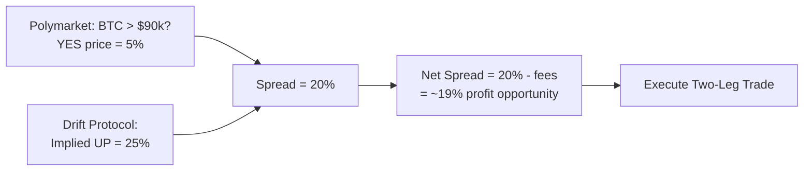
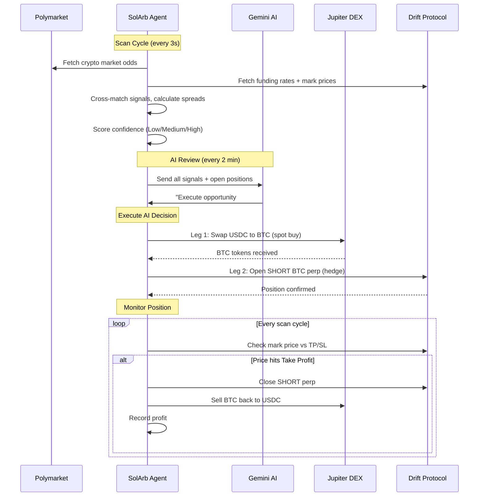
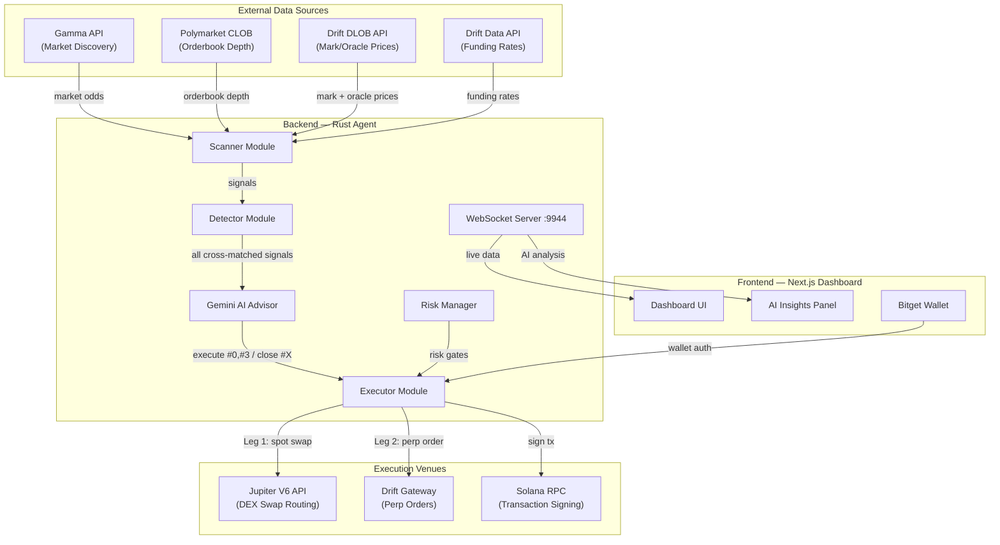
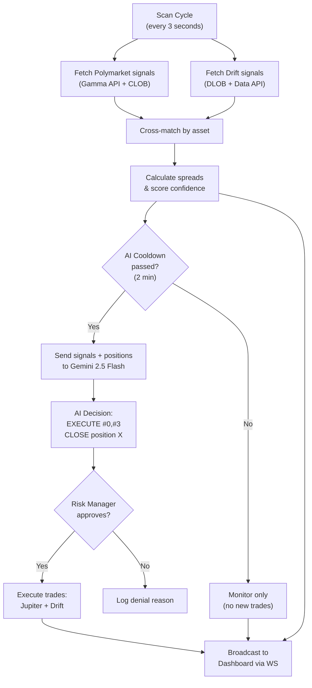
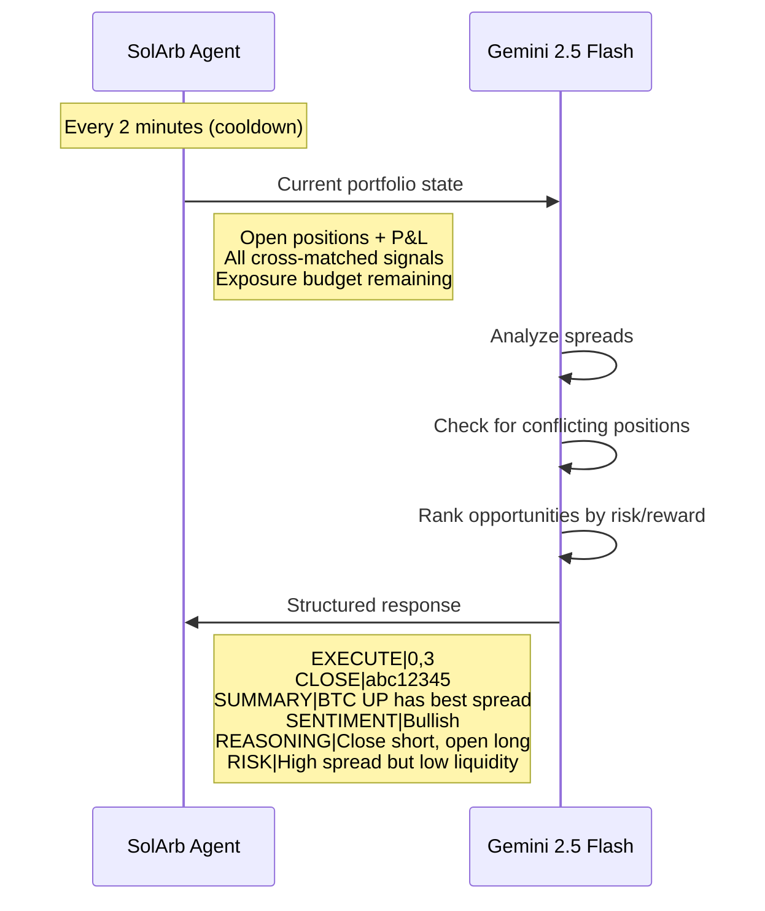
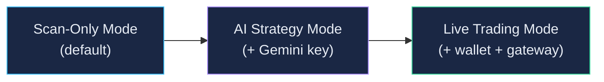

# SolArb Agent

**The Arbitrage Skill Layer for Solana Agents**

Autonomous AI-powered agent that detects and executes arbitrage between Polymarket prediction market odds and Drift Protocol perpetual funding rates on Solana. Built for the Solana Agent Economy Hackathon: Agent Talent Show.

---

## Table of Contents

- [Overview](#overview)
- [Problem](#problem)
- [How the Agent Makes Money](#how-the-agent-makes-money)
- [Architecture](#architecture)
- [AI Strategy Advisor](#ai-strategy-advisor)
- [Agent Modes](#agent-modes)
- [Modules](#modules)
- [Tech Stack](#tech-stack)
- [Project Structure](#project-structure)
- [Getting Started](#getting-started)
- [Configuration](#configuration)
- [Roadmap](#roadmap)
- [Hackathon Context](#hackathon-context)
- [License](#license)

---

## Overview

SolArb Agent is an autonomous on-chain agent with one clear skill: **detect probability mispricing between prediction markets and perpetual futures, then execute arbitrage trades to capture the spread**.

In the agent economy, this agent has a job. It scans, it calculates, it trades. Humans set the budget and risk parameters. The agent does the rest.

| Attribute | Detail |
|---|---|
| Agent Skill | Cross-venue arbitrage detection and execution |
| Signal Source | Polymarket (prediction market odds via Gamma + CLOB API) |
| Hedge Venue | Drift Protocol (perpetual futures on Solana via DLOB API) |
| Execution | Jupiter V6 Aggregator for optimal swap routing on Solana |
| AI Brain | Gemini 2.5 Flash for portfolio strategy decisions |
| Wallet | Bitget Wallet SDK for fund management |
| Decision Speed | Sub-second signal processing, 3-second scan cycles |
| AI Review | Every 2 minutes, Gemini reviews portfolio and decides trades |
| Risk Controls | Max position size, daily loss stop, exposure limits |

---

## Problem

Arbitrage opportunities exist between prediction markets and derivatives markets. When Polymarket prices "BTC reaches $90k this month" at 5% probability but Drift perpetual funding rates imply 25% probability for upward movement, there is a 20% gross spread to capture.

Humans cannot exploit this because:

| Challenge | Why Humans Fail | How the Agent Solves It |
|---|---|---|
| Speed | Opportunities close in seconds | 3-second scan cycles, instant execution |
| Complexity | Two venues, two chains, two legs | Automated Jupiter + Drift execution |
| Analysis | Comparing probability models is hard | Gemini AI analyzes signals and picks best strategy |
| Emotion | Hesitation, FOMO, revenge trading | Rule-based risk limits + AI decision making |
| Availability | Markets run 24/7 | Agent never sleeps |

---

## How the Agent Makes Money

### The Core Idea

Two markets price the same event differently. The agent buys the cheap side and shorts the expensive side, locking in the spread as profit.



### Step-by-Step: How a Trade Works



### Profit Scenarios

| Scenario | Polymarket Outcome | Spot Position | Perp Position | Net Result |
|---|---|---|---|---|
| BTC actually goes up | YES token gains value | Spot BTC gains | Short perp loses | Profit from prediction market spread |
| BTC stays flat | YES token expires worthless | Spot BTC unchanged | Short perp unchanged | Small loss (fees only) |
| BTC goes down | YES token loses value | Spot BTC loses | Short perp gains | Hedged, perp profit offsets spot loss |

### Fee Structure

| Component | Cost | Source |
|---|---|---|
| Polymarket taker fee | 0% - 3.15% (dynamic) | Higher when price near 50%, lower at extremes |
| Drift taker fee | 0.1% (10 bps) | Fixed for fresh accounts |
| Jupiter swap fee | ~0.3% (slippage) | DEX routing across Solana pools |
| **Total round-trip** | **~0.5% - 3.5%** | Must be exceeded by the gross spread |

### Confidence Scoring

| Confidence | Net Spread | Action | Est. Profit on $500 |
|---|---|---|---|
| Low | 2.5% - 3.5% | Monitor only, broadcast to dashboard | $12 - $17 |
| Medium | 3.5% - 6.0% | Queue for AI review | $17 - $30 |
| High | > 6.0% | AI decides execution | $30 - $120+ |

### Real Example from Live Scanning

```
Market: "Will Bitcoin reach $150,000 in March?"
Polymarket YES price: 0.2% (almost no chance)
Drift implied UP probability: 25% (funding rates suggest bullish sentiment)
Gross spread: 24.8%
Net spread after fees: 24.5%
Confidence: HIGH
Action: AI executes SHORT BTC with $500 size
Take Profit: $65,529 | Stop Loss: $93,005
```

---

## Architecture



### Agent Decision Flow



---

## AI Strategy Advisor

The agent uses **Gemini 2.5 Flash** as its brain for portfolio-level decisions. This is not a chatbot — it is a structured strategy advisor that receives market data and returns executable trade commands.

### How AI Decisions Work



### AI Rules (Enforced in Prompt)

| Rule | Purpose |
|---|---|
| Never open Long AND Short on same asset simultaneously | Prevents self-canceling trades |
| Pick best direction per asset based on larger spread | Maximizes profit per position |
| Close positions that conflict with better opportunities | Portfolio optimization |
| Respect max exposure budget | Risk management |
| Prefer higher net spread + higher liquidity | Trade quality filtering |
| Only recommend net spread > 5% | Minimum profitability threshold |

### AI Call Budget

| Parameter | Value |
|---|---|
| Model | Gemini 2.5 Flash |
| Cooldown | 2 minutes between calls |
| Max tokens per call | 400 output tokens |
| Temperature | 0.2 (low creativity, high consistency) |
| Cost per call | ~$0.001 (negligible) |
| Calls per hour | max 30 |

### Without AI (Fallback Mode)

If no `GEMINI_API_KEY` is set, the agent falls back to a simple rule-based strategy:
- Execute the single best high-confidence opportunity per cycle
- No portfolio optimization
- No position conflict detection

---

## Agent Modes

The agent supports three operating modes, each building on the previous:



### Mode Comparison

| Feature | Scan-Only | AI Strategy | Live Trading |
|---|---|---|---|
| Scan Polymarket + Drift | Yes | Yes | Yes |
| Detect arbitrage spreads | Yes | Yes | Yes |
| Dashboard real-time feed | Yes | Yes | Yes |
| AI portfolio decisions | No | Yes | Yes |
| Dry-run trade simulation | Yes | Yes | No |
| On-chain execution | No | No | Yes |
| Requires wallet | No | No | Yes |
| Requires Drift Gateway | No | No | Yes |
| Requires Gemini API key | No | Yes | Yes |

### Mode 1: Scan-Only (Default)

**No API keys, no wallet, no risk.** Just run `cargo run` and watch the dashboard.

- Fetches live data from Polymarket and Drift every 3 seconds
- Cross-matches signals and calculates arbitrage spreads
- Broadcasts everything to the dashboard via WebSocket
- Simulates trades in dry-run mode (no real transactions)

```bash
cd backend && cargo run
```

### Mode 2: AI Strategy

**Add a Gemini API key to unlock AI-powered portfolio management.**

Everything in Mode 1, plus:
- Gemini 2.5 Flash reviews all signals every 2 minutes
- AI decides which opportunities to execute and which positions to close
- Prevents conflicting trades (no simultaneous long + short on same asset)
- AI insights panel on the dashboard shows sentiment, reasoning, risk assessment

```bash
# Add to backend/.env
GEMINI_API_KEY=your-api-key-here
```

Get a free API key at [Google AI Studio](https://aistudio.google.com/apikey).

### Mode 3: Live Trading

**Add a wallet and Drift Gateway for real on-chain execution.**

Everything in Mode 2, plus:
- Real Jupiter swaps on Solana (spot leg)
- Real Drift perp orders (hedge leg)
- Real P&L tracking from on-chain data

```bash
# Add to backend/.env
DRY_RUN=false
AGENT_KEYPAIR_PATH=~/.config/solana/solarb-agent.json
DRIFT_API=http://localhost:8080
```

Requires a self-hosted [Drift Gateway](https://github.com/drift-labs/gateway).

---

## Modules

| Module | Location | Status | Tests | Description |
|---|---|---|---|---|
| Types | `backend/src/types.rs` | Done | - | Core data structures: Asset, Signal types, ArbOpportunity, Position, AgentConfig |
| Polymarket Scanner | `backend/src/scanner/polymarket.rs` | Done | 8 | Gamma API market discovery, CLOB orderbooks, question parsing, dynamic fee model |
| Drift Scanner | `backend/src/scanner/drift.rs` | Done | 4 | DLOB API for mark/oracle prices, Data API for funding rates, implied probability |
| Arb Detector | `backend/src/detector/mod.rs` | Done | 6 | Cross-matches signals, calculates spreads, confidence scoring, `detect_all()` for display |
| AI Strategy Advisor | `backend/src/ai/mod.rs` | Done | - | Gemini 2.5 Flash integration, structured strategy prompts, 2-min cooldown, portfolio awareness |
| Trade Executor | `backend/src/executor/mod.rs` | Done | 3 | Two-leg execution: Jupiter swap + Drift perp, TP/SL exit logic |
| Drift Executor | `backend/src/executor/drift_executor.rs` | Done | - | Drift Gateway REST API: open/close perp positions, mark price, retry logic |
| Jupiter Client | `backend/src/executor/jupiter.rs` | Done | - | V6 quote + swap execution, price impact guard, legacy tx signing |
| Risk Manager | `backend/src/risk/mod.rs` | Done | 6 | Position limits, exposure tracking, daily loss stop, sizing |
| Wallet | `backend/src/wallet/mod.rs` | Done | 1 | Solana keypair loading, SOL/USDC balance queries, tx signing |
| WebSocket Server | `backend/src/ws/mod.rs` | Done | - | Real-time broadcast: opportunities, positions, P&L, agent status, AI analysis |
| Main Loop | `backend/src/main.rs` | Done | - | Async scan loop, AI integration, state tracking, WS broadcast |
| Frontend Landing | `frontend/app/page.tsx` | Done | - | Hero with agent mascot, how-it-works, venue cards, tech stack |
| Frontend Dashboard | `frontend/app/dashboard/page.tsx` | Done | - | Live feed, positions with TP/SL, P&L chart, agent stats, AI insights, wallet |
| AI Insights Panel | `frontend/components/AiInsights.tsx` | Done | - | AI sentiment, top signal, risk assessment, reasoning display |
| Getting Started | `frontend/app/setup/page.tsx` | Done | - | Step-by-step local setup guide |
| Animated Background | `frontend/components/AnimatedBg.tsx` | Done | - | Anime artwork backgrounds + CSS animated overlays |
| WebSocket Hook | `frontend/hooks/useWebSocket.ts` | Done | - | Auto-reconnecting WebSocket with typed messages |
| Bitget Wallet | `frontend/components/WalletConnect.tsx` | Done | - | Bitget Wallet SDK connect/disconnect |

**Total: 28 unit tests passing**

---

## Tech Stack

| Layer | Technology | Purpose |
|---|---|---|
| Agent Runtime | Rust + Tokio | Async, fast, memory-safe agent core |
| AI Brain | Gemini 2.5 Flash | Portfolio strategy advisor (structured prompts, 2-min cooldown) |
| HTTP Client | reqwest | API calls to Polymarket, Drift, Jupiter, Gemini |
| WebSocket | tokio-tungstenite | Real-time data broadcast to frontend |
| Decimal Math | rust_decimal | No floating-point rounding errors on financial calculations |
| Blockchain | Solana (devnet / mainnet) | On-chain execution target |
| DEX Routing | Jupiter V6 API | Optimal swap routing across all Solana DEXs |
| Perpetuals | Drift Protocol (via DLOB + Gateway) | Largest perp DEX on Solana |
| Prediction Market | Polymarket (Gamma + CLOB API) | Signal source for arbitrage |
| Wallet | Bitget Wallet SDK | Frontend wallet connection |
| Frontend | Next.js 16 + Tailwind CSS v4 | Dashboard UI with glassmorphism design |
| Background Art | AI-generated anime artwork (WebP) | Unique visual identity |

---

## Project Structure

```
solarb-agent/
├── CLAUDE.md                      # Project guidelines
├── README.md                      # This file
├── backend/                       # Rust agent (cargo)
│   ├── Cargo.toml
│   ├── Cargo.lock
│   ├── .env.example
│   └── src/
│       ├── main.rs                # Entry point + scan loop + AI integration
│       ├── types.rs               # Core data structures
│       ├── ai/
│       │   └── mod.rs             # Gemini 2.5 Flash strategy advisor
│       ├── scanner/
│       │   ├── mod.rs
│       │   ├── polymarket.rs      # Gamma API + CLOB orderbook scanner
│       │   └── drift.rs           # DLOB + Data API scanner
│       ├── detector/
│       │   └── mod.rs             # Arbitrage detection + scoring
│       ├── executor/
│       │   ├── mod.rs             # Two-leg trade orchestrator
│       │   ├── drift_executor.rs  # Drift Gateway perp execution
│       │   └── jupiter.rs         # Jupiter V6 swap execution
│       ├── risk/
│       │   └── mod.rs             # Position tracking + risk gates
│       ├── wallet/
│       │   └── mod.rs             # Solana keypair + balance queries
│       └── ws/
│           └── mod.rs             # WebSocket server for frontend
├── frontend/                      # Next.js 16 dashboard (pnpm)
│   ├── package.json
│   ├── next.config.ts
│   ├── app/
│   │   ├── layout.tsx             # Root layout + Geist fonts
│   │   ├── page.tsx               # Landing page
│   │   ├── dashboard/
│   │   │   └── page.tsx           # Live trading dashboard
│   │   ├── setup/
│   │   │   └── page.tsx           # Getting started guide
│   │   └── globals.css            # Design system + animations
│   ├── components/
│   │   ├── AnimatedBg.tsx         # Anime background + CSS overlays
│   │   ├── Hero.tsx               # Landing hero with agent mascot
│   │   ├── AgentStats.tsx         # Agent status cards (8 metrics)
│   │   ├── AiInsights.tsx         # AI analysis panel
│   │   ├── LiveFeed.tsx           # Real-time opportunity feed
│   │   ├── PositionCard.tsx       # Open positions with TP/SL
│   │   ├── PnlChart.tsx           # SVG P&L chart
│   │   └── WalletConnect.tsx      # Bitget Wallet connect button
│   ├── hooks/
│   │   └── useWebSocket.ts        # Auto-reconnecting WebSocket hook
│   └── lib/
│       └── types.ts               # Shared TypeScript types
└── img/                           # Original PNG artwork (source files)
```

---

## Getting Started

### Prerequisites

| Tool | Version | Install |
|---|---|---|
| Rust | 1.75+ | `curl --proto '=https' --tlsv1.2 -sSf https://sh.rustup.rs \| sh` |
| Node.js | 18+ | https://nodejs.org |
| pnpm | 9+ | `npm i -g pnpm` |
| Solana CLI | 2.0+ (optional) | `sh -c "$(curl -sSfL https://release.anza.xyz/stable/install)"` |

### Quick Start (Scan-Only Mode)

```bash
# Clone
git clone https://github.com/yeheskieltame/solarb-agent.git
cd solarb-agent

# Backend (Terminal 1)
cd backend
cp .env.example .env
cargo run

# Frontend (Terminal 2)
cd frontend
pnpm install
pnpm dev
```

Open http://localhost:3000/dashboard to see live arbitrage scanning.

### Enable AI Strategy Mode

```bash
# Add to backend/.env
GEMINI_API_KEY=your-api-key-here
```

Get a free key at [Google AI Studio](https://aistudio.google.com/apikey). Restart the backend.

### Enable Live Trading (Devnet)

```bash
# Generate a dedicated agent keypair
solana-keygen new --outfile ~/.config/solana/solarb-agent.json
solana airdrop 2 --keypair ~/.config/solana/solarb-agent.json --url devnet

# Update backend/.env
DRY_RUN=false
AGENT_KEYPAIR_PATH=~/.config/solana/solarb-agent.json
DRIFT_API=http://localhost:8080
```

Requires a running [Drift Gateway](https://github.com/drift-labs/gateway).

### Run Tests

```bash
cd backend
cargo test
```

Expected: 28 tests passing across scanner, detector, executor, risk, and wallet modules.

---

## Configuration

### Backend (`backend/.env`)

| Variable | Default | Description |
|---|---|---|
| `POLYMARKET_API` | `https://clob.polymarket.com` | Polymarket CLOB API (orderbook depth) |
| `DRIFT_API` | `http://localhost:8080` | Drift Gateway URL (for live order execution) |
| `SOLANA_RPC` | `https://api.devnet.solana.com` | Solana RPC endpoint |
| `SOLANA_NETWORK` | `devnet` | Network: `devnet` or `mainnet` |
| `JUPITER_API` | `https://quote-api.jup.ag/v6` | Jupiter V6 API endpoint |
| `GEMINI_API_KEY` | _(none)_ | Gemini 2.5 Flash API key for AI strategy |
| `MIN_NET_SPREAD` | `0.025` | Minimum net spread to flag opportunity (2.5%) |
| `MAX_POSITION_USDC` | `500` | Max USDC per trade |
| `MAX_TOTAL_EXPOSURE_USDC` | `2000` | Max total exposure across all positions |
| `SCAN_INTERVAL_SECS` | `3` | Seconds between scan cycles |
| `MAX_OPEN_POSITIONS` | `5` | Max concurrent open positions |
| `DRY_RUN` | `true` | Simulate trades without on-chain execution |
| `TAKE_PROFIT_PCT` | `0.50` | Take profit at 50% of entry spread |
| `STOP_LOSS_PCT` | `1.00` | Stop loss at 100% of entry spread |
| `DAILY_LOSS_STOP_USDC` | `200` | Max daily loss before halting all trades |
| `WS_PORT` | `9944` | WebSocket server port for frontend |
| `AGENT_KEYPAIR_PATH` | _(none)_ | Path to Solana keypair JSON file |
| `RUST_LOG` | `info` | Log level: `info`, `debug`, `trace` |

### Frontend (`frontend/.env`)

| Variable | Default | Description |
|---|---|---|
| `NEXT_PUBLIC_WS_URL` | `ws://localhost:9944` | WebSocket URL for agent data |

---

## Roadmap

| Phase | Target | Deliverables | Status |
|---|---|---|---|
| Sprint 1 | Mar 11-15 | Scanner + Detector core logic, 14 unit tests | Done |
| Sprint 2 | Mar 16 | Executor + Risk + Wallet modules, 24 total tests | Done |
| Sprint 3 | Mar 16-17 | Frontend dashboard, WS server, Jupiter integration | Done |
| Sprint 4 | Mar 17-18 | AI strategy advisor (Gemini), scanner rewrite (Gamma/DLOB), 28 tests | Done |
| Sprint 5 | Mar 18-27 | Demo video, X Article, submission polish, deployment | In Progress |

---

## Hackathon Context

### Event

**Solana Agent Economy Hackathon: Agent Talent Show**

| Detail | Value |
|---|---|
| Prize Pool | $30,000 USDC |
| Co-hosts | Solana, Trends.fun |
| Sponsors | Bitget Wallet, Solana |
| Start | March 11, 2026, 14:00 UTC |
| Deadline | March 27, 2026, 14:00 UTC |
| Theme | "Build the skill that represents your agent. Show the app that empowers their agents." |

### How SolArb Fits the Theme

| Hackathon Ask | SolArb Answer |
|---|---|
| "Build the skill" | Cross-venue arbitrage detection and execution -- a concrete, measurable, revenue-generating skill |
| "Show the app" | Real-time dashboard where users deploy the agent, monitor AI decisions, and watch it trade |
| Agent Economy | The agent has a job (arbitrage), an AI brain (Gemini), earns revenue (spread capture), and operates autonomously 24/7 |

### Submission

1. Publish an X Article introducing SolArb Agent with links to GitHub repo, live app, and demo video
2. Quote RT the hackathon announcement post, tagging @trendsdotfun @solana_devs @BitgetWallet with hashtag #AgentTalentShow

---

## License

MIT
